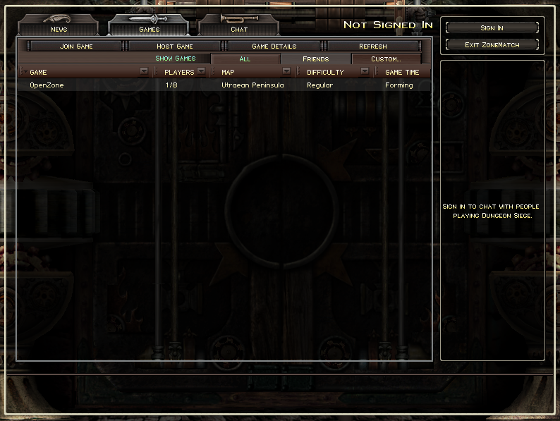

# open-zone

An open ZoneMatch server for **Dungeon Siege 1**.



---

## Overview

This repo hosts:
- a native **DirectPlay8 server shim** (`dp8shim/`), and
- a single Go runtime (`cmd/open-zone/`) that implements the app-layer protocol above DP8 and serves a minimal News endpoint.

If you are trying to understand the protocol, start with:
- `docs/design.md` (architecture)
- `docs/dp8-messages.md` (DP8 app-protocol schemas + flows)

## What Works

- DP8 transport works via Windows `dpnet.dll`.
- The game advances past **"Connecting to ZoneMatch Server..."** using app-protocol replies:
  - `ConnectRes`, `ConInfoRes`, `ConnectEv`
- Games list refresh works (headers + page results can render rows), and host-published `HostData` state is ingested.

## Working Flows

See `docs/dp8-messages.md` for message shapes and sequencing.

- Connect (Internet entry): `Connect` -> `ConnectRes` + `ConInfoRes` + `ConnectEv`
- Games list (browse): `HdrRow` -> `HdrRowRes`, then `Page` -> `PageRes` (rows under `<PageRes>` as `<Row .../>`)
- Game details (staging/details refresh): `RowPg` -> `RowPgRes`
- Hosting updates: `SetLoc` -> `SetLocRes`, `HostData` -> `HostDataRes` (server stores host state and uses it for browse rows)
- News: HTTP on `:2301` (`GET /` serves `news.txt`)
- AutoUpdate: optional "fail fast" TCP sink on `:80` (accept+close, not a real AutoUpdate implementation)

## Not Working Flows

- AutoUpdate: nothing will auto-update (no HTTP handler / update protocol support). The optional port `80` sink only exists to fail fast and avoid UI timeouts.
- Chat: no chat room / lobby chat support.
- Accounts: no sign-in / create-account support.

Notes:
- Join requires `IpAddr` to be populated in the browse row; the client can connect directly to the host.

## Requirements

Runtime:
- Windows (DirectPlay8 runtime is `dpnet.dll`)
- Go 1.26 (see `go.mod`)

Build-time (for the shim):
- Visual Studio 2022 Build Tools (or VS) with **Desktop development with C++**
- DirectX headers are vendored into `dp8shim/include/`

## Ports

This project runs three local listeners by default:
- DP8 + app-protocol: `2300` (transport handled by DirectPlay)
- News (HTTP): `2301` (GET `/` serves `news.txt`)
- AutoUpdate sink (TCP): `80` (accept+close to fail fast; no update support)

## Quickstart

### Option A: mise (recommended)

If you use `mise`, it can install tool versions and provide common commands via `mise run ...`.

1. Install tools:

```powershell
mise install
```

2. Build the shim (Windows):

```powershell
mise run build-shim
```

3. Run:

```powershell
mise run run
```

4. Optional: hot reload:

```powershell
mise run setup-tools
mise run dev
```

### Option B: manual

1. Build the shim (outputs `bin/dp8shim.dll`):

```powershell
cd dp8shim
.\build.ps1
```

2. Run the server:

```powershell
go run ./cmd/open-zone
```

3. Point the game at your machine (edit the multiplayer settings) to use the local servers:

```ini
[multiplayer]
gun_server = 127.0.0.1
gun_server_port = 2300
news_server = 127.0.0.1
news_server_port = 2301
news_server_file = /
autoupdate_server = 127.0.0.1
autoupdate_proxy = 127.0.0.1
```

Notes:
- The `autoupdate_*` values are only to point the client at the optional port 80 fail-fast sink (to avoid UI timeouts). This project does not implement AutoUpdate.

4. Optional: hot reload (requires `air`):

```powershell
go install github.com/air-verse/air@latest
air
```

## Configuration

Config file (optional):
- `config/config.yaml`

Env overrides:
- prefix `OZ_`
- `.` becomes `_` (example: `dp8.port` -> `OZ_DP8_PORT`)

Useful knobs:
- `dp8.port` (default `2300`)
- `news.port` (default `2301`)
- `autoupdate.port` (default `80`, set to `0` to disable)
- `shim.path` (default `bin\\dp8shim.dll`)
- `telemetry.dp8_ndjson_path` (empty disables NDJSON file logging)

**Remote hosting:** Set `dp8.advertise_ip` and `dp8.advertise_port` to the public hostname/IP and port clients should use to reach this server (e.g. your VM’s public IP and 2300). Leave empty/0 for local-only (defaults to `127.0.0.1:<dp8.port>`). This affects the `ConInfoRes` reply sent to connecting clients.

## Logs

- Console logging: always on
- App-protocol telemetry (NDJSON): `logs/dp8.ndjson` (only when enabled)

## Repo Layout

- `cmd/open-zone/`: main entrypoint
- `internal/`
  - `internal/config/`: config loading + defaults
  - `internal/dp8/`: DP8 event loop + send queue
  - `internal/dp8shim/`: Go loader for `bin/dp8shim.dll`
  - `internal/proto/`: XML-ish message parsing + protocol handlers + host state
  - `internal/news/`: minimal News HTTP server
  - `internal/autoupdate/`: best-effort AutoUpdate “fail fast” sink (no update support)
  - `internal/packetlog/`: NDJSON logger
- `dp8shim/`: native shim source + build scripts
- `bin/`: runtime binaries (see `bin/README.md`)
- `docs/`: protocol/design docs

## Building a deploy bundle

`mise run deploy-build` produces a portable Windows x64 bundle under `./deploy/` that you can copy to another machine.

**What it does:**

1. **Fresh output directory**  
   Removes any existing `deploy/` and recreates `deploy/`, `deploy/bin`, and `deploy/config`.

2. **Shim**  
   Runs the same shim build as `mise run build-shim`. If `dp8shim.dll` is in use (e.g. server running), the build is skipped and the existing DLL is used for staging.

3. **Server binary**  
   Builds the Go server for Windows x64:
   - `GOOS=windows`, `GOARCH=amd64`, `CGO_ENABLED=0`
   - `go build -trimpath -ldflags "-s -w"` → `deploy/open-zone.exe`

4. **Staged artifacts**  
   Copies into `deploy/`:
   - `bin/dp8shim.dll` (and `bin/dp8shim.pdb` if present) → `deploy/bin/`
   - `config/config.yaml` → `deploy/config/`
   - `README.md`, `run-server.bat`, and `docs/` → `deploy/`

**Usage:**

```powershell
mise run deploy-build
```

The resulting `deploy/` folder can be run on any Windows x64 machine; run `open-zone.exe` from the `deploy` directory (it expects `bin/dp8shim.dll` and `config/config.yaml` relative to the current directory).

## Dev (Format/Lint)

With `mise`:

```powershell
mise run fmt
mise run lint
mise run test
```

Without `mise`:

```powershell
gofmt -w .
go test ./...
go run github.com/golangci/golangci-lint/cmd/golangci-lint@v1.63.4 run ./...
```

## Troubleshooting

- **`DP8_StartServer failed hr=0x80070005` (E_ACCESS_DENIED) when running remotely (e.g. on a VM)**  
  The DirectPlay8 stack is being blocked from binding to the DP8 port (default 2300). Fix both:  
  1. **VM / cloud firewall** – In the cloud console (AWS security group, Azure NSG, GCP firewall, etc.), allow **inbound TCP 80, UDP 2300, and TCP 2301** (HTTP News) to the VM.  
  2. **Windows Firewall on the VM** – Add inbound rules. In PowerShell (run as Administrator):  
     `New-NetFirewallRule -DisplayName "open-zone DP8" -Direction Inbound -Protocol UDP -LocalPort 2300 -Action Allow`  
     `New-NetFirewallRule -DisplayName "open-zone News" -Direction Inbound -Protocol TCP -LocalPort 2301 -Action Allow`  
     `New-NetFirewallRule -DisplayName "open-zone AutoUpdate" -Direction Inbound -Protocol TCP -LocalPort 80 -Action Allow`  
  - Ensure the process runs under an account that can open listening sockets (usually any normal user can).

- **Running on remote servers (VM / Windows Server)**  
  DirectPlay is not enabled by default. On the server, run in an elevated command prompt, then reboot:

  ```
  dism /online /enable-feature /featurename:LegacyComponents /all /norestart
  dism /online /enable-feature /featurename:DirectPlay /all /norestart
  shutdown /r /t 0
  ```

- **Join times out when a player hosts a game**  
  open-zone is the ZoneMatch lobby server; joining a game connects **directly** to the host’s machine via DirectPlay. If the host is behind NAT, the joiner cannot reach them unless the host’s router forwards the game session ports to the host:
  - **6073 UDP** – primary (inbound for hosting, outbound for joining)
  - **2302–2400 UDP** – secondary
  ZoneMatch (2300 UDP) is only for the lobby. Without port forwarding on the host’s NAT, join will time out even when the Games list shows the correct host IP.

- `dp8shim` fails to load
  - Ensure `bin/dp8shim.dll` exists (run `dp8shim/build.ps1`)
  - Ensure bitness matches (this Go app is `windows/amd64`; shim must be x64)

- No DP8/app-protocol logs when you click UI buttons
  - NDJSON logging is off by default: set `telemetry.dp8_ndjson_path` to enable.

- Rebuilding `dp8shim.dll`
  - Stop the Go process first (Windows locks loaded DLLs).
